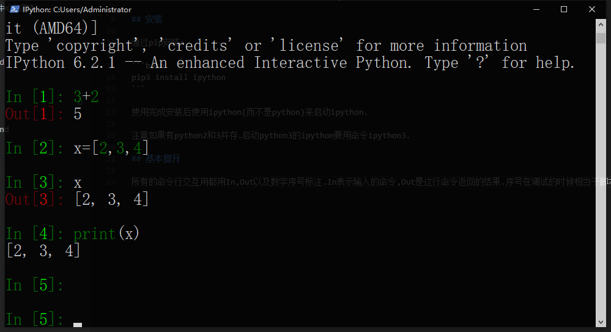
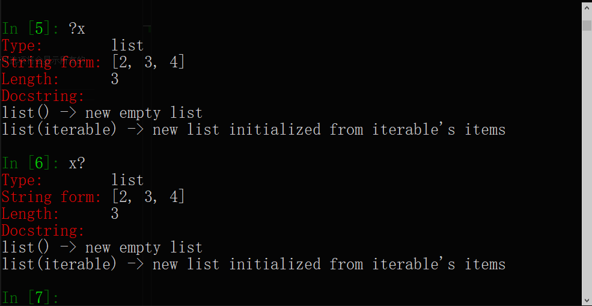

# 0X07 IPython

## 简介

IPython是一个增强的Python交互式编程环境(或者叫交互式解释器,有的地方也叫Python shell).它比Python自带的交互式编程环境更加友好,提供了自动补全,查看变量内容,语法高亮(彩色代码)之类的功能.

注意这是一个注重于人机交互的模块,而不是用于加快Python虚拟机效率的.不要和JIT编译器混淆.

## 安装

通过pip安装:

```bash
pip3 install ipython
```

使用完成安装后使用ipython(而不是python)来启动ipython.

注意如果有python2和3并存.启动python3的ipython要用命令ipython3.

## 基本提升

所有的命令行交互用都用In,Out以及数字序号标注.In表示输入的命令,Out是这行命令返回的结果.序号在调试的时候相当于脚本中行号的作用.



print的内容不会标注Out.所有的标准输出流输出都不用Out标准.

在一个函数或者变量名没有输入完时按Tab键可以自动补全输入.如果有多个可选项将会显示所有的候选项目.

在异常出现的时候,ipython显示的跟踪信息还会把抛出异常位置附近的几行代码显示出来.

输入方面,ipython提供了一些类似bash快捷键(不完全相同)的快捷键.用于移动光标和复制粘贴.

IPython也增强了pdb的交互.

## 查看变量

在变量名前或者后边加一个'?'可以查看变量的内容,类型等信息.



注意这只是一个查看手段,而不是表达式.不能用于运算.

## 控制命令(Magic Command)

python自带的交互式环境内虽然可以把自己写的脚本当作模块导入.却很不方便用直接在交互式环境内直接执行脚本,执行完之后仍然留在交互式编程环境中(我一般靠复制粘贴).

使用ipython的控制命令就可以轻松完成这个功能.ipython的控制命令全部以'%'开头,后边紧跟命令名,然后接空格和命令参数.比如

```ipython
%run hello.py
```

表示在交互式编程环境中执行hello.py这个脚本.

除此以外ipython还有许多其他命令,例如用'%pdb'控制是否在异常发生后自动进入pdb.用'%paste'执行剪贴板中的代码,用'%quickref'显示IPython的快速参考,用'%magic'显示所有magic command参考.

## 执行bash命令

以'!'开头,后边直接写bash命令就能执行bash命令.例如:

```ipython
!ls
```

## Jupyter

目前IPython项目专注于做Python交互.原来属于IPython的,和具体编程语言无关的notebook,qtconsole等部分都被逐渐移到了Jupyter.如果需要一个能利用浏览器进行展示的notebook或者一个基于qt的窗体版控制台可以安装基于IPython的Jupyter.
