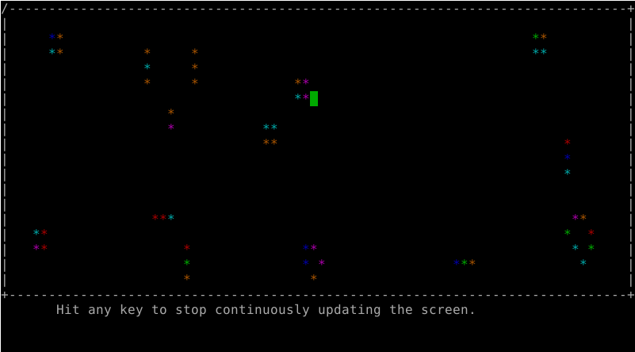
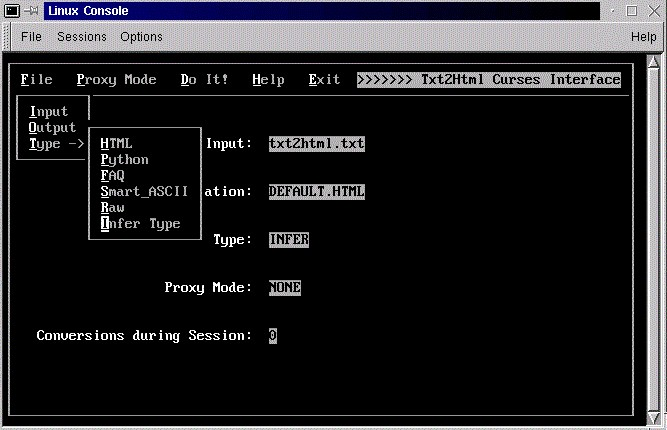

# 0X09 curses (Python Module)

## 简介

curses library是一个在字符终端下编写交互界面的工具包.它可以用符号,前景色背景色拼接出窗口,按钮,菜单,输入框等控件的样子.而使用这个工具的时候则不需要操心printf语句或者ANSI Escape Code的问题.只需要像写图形化界面下的窗体程序一样,定义按钮坐标和内容,菜单位置和选项之类的东西就行了.

这里所说的curses是这个库的Python接口版.目前它已经被集成到了Python当中.使用这个命令导入即可:^

```python
import curses
```

但是请注意,这个库适用于POSIX标准系统.而Windows并不完全符合POSIX标准(其实微软对外宣传是符合的,为了接一些对POSIX标准有要求的生意).所以在Windows上可能会找不到这个包.

## 使用效果

Python官网上有一个用curses写的[康威的生命游戏](https://en.wikipedia.org/wiki/Conway%27s_Game_of_Life)的[demo](https://github.com/python/cpython/blob/3.6/Tools/demo/life.py).




而用它构建出来的伪图形化界面则像是这样:



## 资料

[官方文档1](https://docs.python.org/3/library/curses.html)

[官方文档2](https://docs.python.org/3/library/curses.ascii.html)

[官方文档3](https://docs.python.org/3/library/curses.panel.html)

[官方提供的教程](https://docs.python.org/3/howto/curses.html)